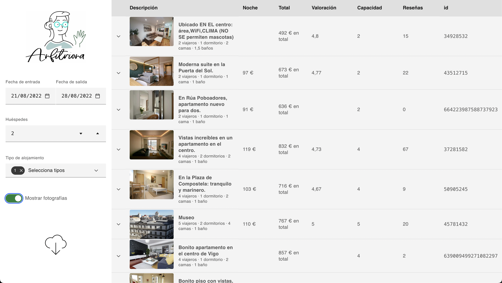

# vigobnb

Un amigo opera varios apartamentos turísticos en Vigo. Él se ha portado muy bien conmigo, y yo he querido dar reciprocidad a esa amistad con Vigobnb.

Vigobnb conecta con Airbnb, obtiene y presenta los precios de los alojamientos turísticos en la ciudad de Vigo y alrededores. También permite descargarlos en formato CSV. Esto es útil para entender cómo está el fluctuante mercado del alojamiento turístico en un momento y lugar dados. Y utilizar ese conocimiento para establecer unos precios propios competitivos en este mercado ([inteligencia competitiva](https://en.wikipedia.org/wiki/Competitive_intelligence)).

El sitio [está desplegado](https://vigobnb.netlify.app) en línea.

Tras casi un año como un pequeño proyecto personal y privado, publico este repositorio como software libre, por si pudiera resultar útil a otras personas en otros lugares.

Para ello deberás hacer cambios en el programa, pues Vigobnb está configurado para satisfacter las concretas necesidades de mi amigo y su actividad. Afortunadamente, el código fuente está limpio y convenientemente estructurado para hacer estos cambios.

Por último, la API de Airbnb es un servicio vivo. Cuando la compañía hace cambios en ella, Vigobnb puede romperse. En este caso es preciso actualizar el programa para adaptarlo a dichos cambios.

Jaime Gómez-Obregón
